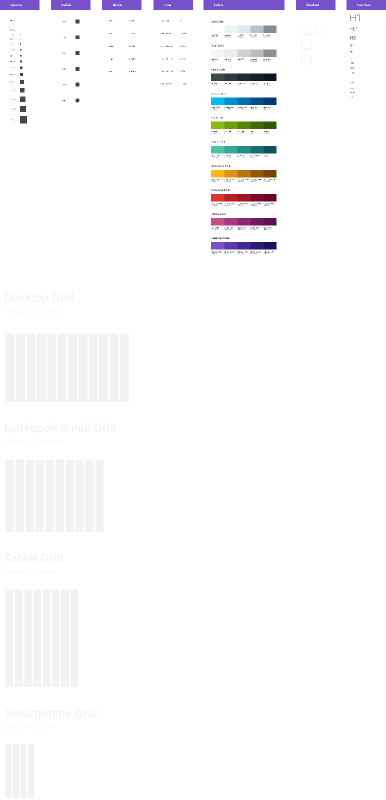

# Figmagic

This library is based in the original [Figmagic](https://github.com/mikaelvesavuori/figmagic) by [Mikael Vesavuori](https://github.com/mikaelvesavuori).

[](https://travis-ci.org/andredovale/figmagic)

---

Extract design tokens for any value in Figma. A typical use case for the generated documents is to use the extracted values as a token base in CSS systems that support external values (such as Styled Components, other CSS-in-JS libraries, or Sass).

---

## .figmagic.json

Figmagic have a default `.figmagic.json`, and, to work without modifications requires that your document structure is identical to the template available at [Figma example project].

But, if you need to extend and modify the default settings, create a file named `.figmagic.json` in the same level where you are using the cli command `figmagic`, and use the option `--config-file` (or only `-c`).

Open the [.figmagic.json](.figmagic.json) to view the default values, and see the [src/types/config.ts](src/types/config.ts) to understand the structure of this file.

---

## CLI commands

Base command:

```(cli)
figmagic
```

Options:
| Command | Description | Type | Accepted values | Default value |
|-------------------|-----------------------------------------------------------|:-------:|:-----------------------------------:|:-------------:|
| `--help, -h` | Show help | `boolean` | | `false` |
| `--version, -v` | Show version number | `boolean` | | `false` |
| `--format, -f` | Choose a output format | `string` | `"css"`, `"js"`, `"json"`, `"sass"`, `"scss"` | `"js"` |
| `--config-file, -c` | Extend and modify the default config file: `.figmagic.json` | `boolean` | | `false` |
| `--figma-url, -u` | Figma project identification URI | `string` | | `""` |
| `--figma-token, -t` | Figma development API authorization token | `string` | | `""` |
| `--figma-page, -p` | Name of tokens page on Figma | `string` | | `"Design Tokens"` |
| `--output, -o` | Folder path for the generated tokens | `string` | | `"tokens"` |

---

## .env

If you need to secure your Figma input data, is possible to use a enviroment file named `.env` in the same level where you are using the cli command `figmagic`.

Options:
| Variable | Description | Type |
|-------------------|-----------------------------------------------------------|:-------:|
| `FIGMA_URL` | Figma project identification URI | `string` |
| `FIGMA_TOKEN` | Figma development API authorization token | `string` |
| `FIGMA_PAGE` | Name of tokens page on Figma | `string` |

Off course, ensure your `.env` file isn't versioned (see this in your `.gitignore` file).

---

## Installation

- Clone Figmagic
- Step into the Figmagic directory, and run `yarn setup` or `npm run setup` to add it globally to your system
- Step into a project directory, and add or replace **FIGMA_URL** and **FIGMA_TOKEN** in .env with your own file ID and token key (for more on this, [go to Figma's developer docs](https://www.figma.com/developers/docs))
- Run `figmagic`
- You should now have a `/tokens` folder in the root! The `/tokens` folder has the good stuff you want

## Figma setup

Your structure needs to correspond to the following:

- A Page needs to exist, called "Design Tokens" (or set the name in the `.figmagic.json` or `.env` enviroment variable `FIGMA_PAGE`).
- Further, inside the "Design Tokens" page, frames need to be exist. Is the same names inside the `tokens` collection in `.figmagic.json`.
- All items on a page need to be contained within one or more frames

See a demo/template at [Figma example project]. Feel free to simply copy it and paste it into your own document.

**Note:** Refer to the the document structure in the image below and in the template linked above.



---

## Figma styles

Figma styles became publicly available in June 2018 and are incredibly valuable for designers to create single-sources-of-truth when it comes to design values (tokens). When using Figmagic though, the thinking and usage is a bit different from how Figma styles work.

### Unidimensional or multidimensional values

A Figma style is multidimensional: It contains any number of properties wrapped into one style, acting as kind of a package. This is extremely handy in a design environment and is very practical from a user standpoint. The user doesn't have to think too hard about storing "redundant" values that are the same in another component, such as N number of units for line height: They are all taken care of.

Figmagic instead expresses tokens as instances of every individual value, thus being unidimensional – storing only one value per item. Examples could be sets of line heights, font weights, or font sizes, each one individually specified. This means that values can be used and mixed as pleased in any number of contexts, not becoming bound to one specific context such as a certain kind of heading. This is good for a developer because we would rather just map out the definitive values for something, onto a component (a "context" so to speak).

Because of this difference, the appropriate way to structure a Figmagic-compatible Figma design document is to display one or more items/tokens in the respective frames that correspond to the accepted token types (line height, font size...) where each item has only one key property that's changed in-between them (such as one text using size 48, the next using size 40...), since those items are what Figmagic loops through when creating your code tokens.

### Q: OK, but should I use Figma styles (also) when using Figmagic

A: Whatever suits you! As long as you remember that what Figmagic fetches are those single (unidimensional) values from each design item/token it should all work. Figma styles may help you to work though, and is probably just a good thing for any regular normal design work. Again though, Figmagic does not use those values.

---

## Structure

- `dist` contains the projects CJS file builded with the help of `Rollup`;
- `src` contains the source code (with `TypeScript`);

---

## Q: Want to add or rethink something in Figmagic

A: You are very welcome to contribute to the project! Pull requests welcome, as well as issues or plain messages.

---

## TO DO list

- [ ] Export Figma JSON as `.json` (currently is the same type from `format` option of `.figmagic.json` );
- [ ] Implement another outputs formats (as `.sass` or `.scss`, `.less`, `.json` etc);
- [ ] Implement another colors formats;
- [ ] Implement another css units;
- [ ] Implement the option to specifc the `key` to use as name for the token.

[figma example project]: https://www.figma.com/file/WxG6QtKZKH4WqSRZX5xm8B
